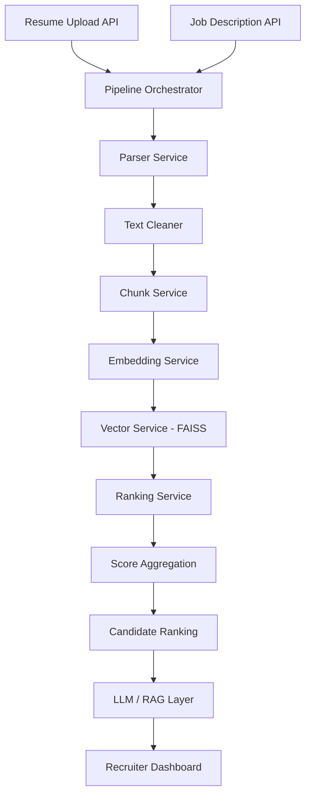
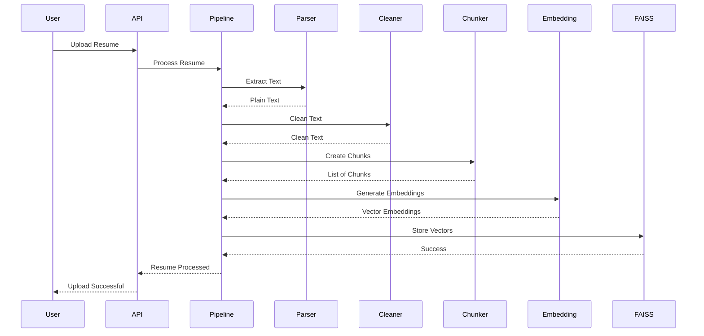
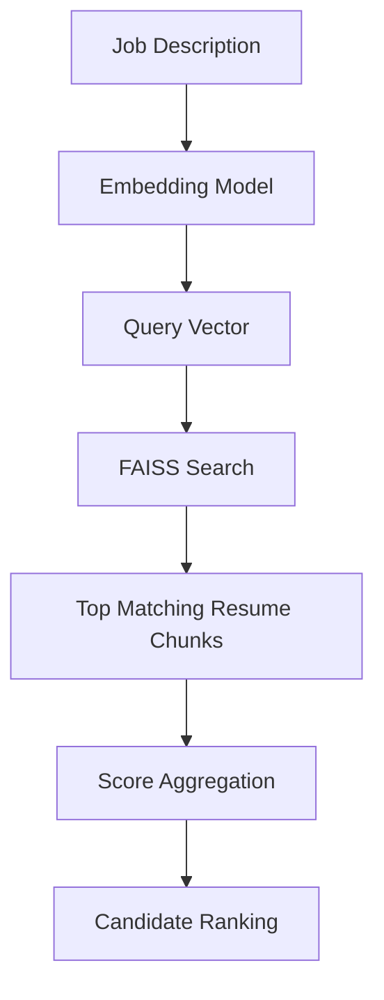
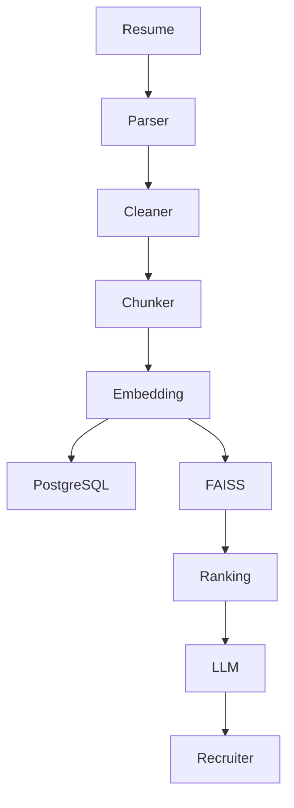
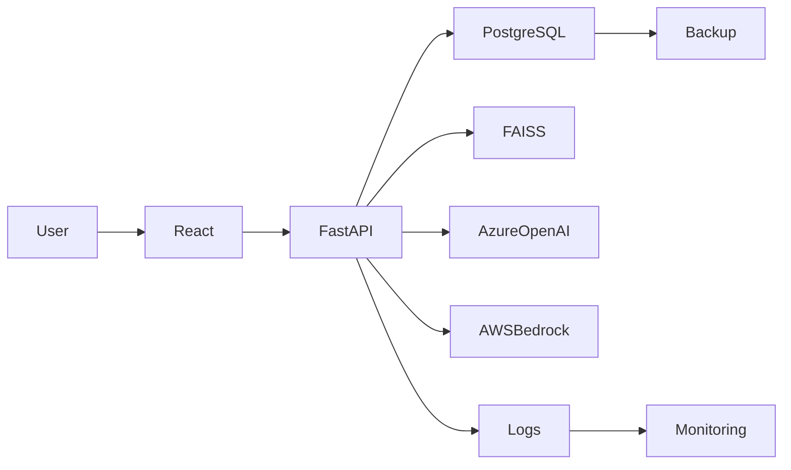

# AI Resume Screening System

An end-to-end AI-powered Resume Screening System that intelligently analyzes resumes and ranks candidates against a given job description using semantic search, vector embeddings, and AI-based similarity scoring.

Unlike traditional Applicant Tracking Systems (ATS) that rely on exact keyword matching, this project understands the semantic meaning of resumes and job descriptions. It uses transformer-based embeddings to compare the overall context and meaning of candidate profiles rather than searching for individual keywords.

The project is being developed using production software engineering practices with a modular backend architecture, reusable services, vector databases, and a scalable AI pipeline. It is designed as a complete AI Engineering portfolio project that demonstrates backend development, machine learning integration, vector search, retrieval systems, and modern GenAI architecture.

---

# Problem Statement

Traditional resume screening systems suffer from several limitations:

- Exact keyword matching often ignores relevant candidates.
- Recruiters spend significant time manually reviewing resumes.
- Similar skills expressed with different wording are frequently missed.
- Large-scale hiring becomes slow and inefficient.
- Existing systems provide limited explainability.

For example,

Job Description

Python, FastAPI, Machine Learning

Resume A

REST API Development using FastAPI
Machine Learning Engineer

A keyword-based ATS may fail to identify Resume A as a strong match because the wording differs.

Semantic search overcomes this limitation by understanding the meaning of the text instead of comparing exact words.

---

# Project Objectives

The objectives of this project are:

- Build a production-ready AI Resume Screening System.
- Learn modern AI Engineering practices.
- Understand semantic search and vector databases.
- Implement a complete resume processing pipeline.
- Design scalable backend APIs using FastAPI.
- Integrate AI models into backend services.
- Deploy the application using modern DevOps practices.
- Extend the system with Large Language Models (LLMs) for recruiter assistance.

---

# Key Features

## Backend

- FastAPI REST APIs
- Modular project structure
- Service-based architecture
- Pydantic validation
- API documentation with Swagger UI

---

## Resume Processing

- Resume upload
- PDF parsing
- DOCX parsing
- Text extraction
- Text cleaning
- Intelligent chunking

---

## Artificial Intelligence

- Transformer-based sentence embeddings
- Semantic similarity search
- FAISS vector database
- Candidate ranking
- Similarity scoring
- Metadata management

---

## Upcoming Features

- PostgreSQL integration
- SQLAlchemy ORM
- Persistent FAISS index
- Automatic processing pipeline
- JWT authentication
- React recruiter dashboard
- Docker support
- AWS deployment
- LLM integration
- Resume summarization
- Skill extraction
- Hiring recommendations
- Recruiter chatbot using RAG

---

# Current Architecture

```
Resume Upload
       │
       ▼
Resume Parser
       │
       ▼
Text Cleaner
       │
       ▼
Chunk Service
       │
       ▼
Embedding Model
       │
       ▼
FAISS Vector Store
       │
       ▼
Candidate Ranking Engine
       │
       ▼
Score Aggregation
       │
       ▼
Ranked Candidates
```

---

# Technology Stack

## Backend

- Python
- FastAPI
- Uvicorn

## Artificial Intelligence

- Sentence Transformers
- all-MiniLM-L6-v2
- FAISS
- NumPy

## Resume Processing

- PyPDF
- python-docx

## Data Validation

- Pydantic

## Version Control

- Git
- GitHub

## Upcoming Technologies

- PostgreSQL
- SQLAlchemy
- React
- Docker
- AWS
- Azure OpenAI
- AWS Bedrock

---

# Project Status

Current Progress

**Approximately 45% Complete**

Completed

- Backend Architecture
- Resume Upload API
- Resume Parsing
- Text Cleaning
- Chunking
- Sentence Embeddings
- Vector Search
- Metadata Store
- Candidate Ranking
- Score Aggregation

The remaining phases focus on database integration, production architecture, frontend development, deployment, and LLM-powered recruiter assistance.

# AI Concepts Behind the Project

This project is not a traditional keyword-based Applicant Tracking System (ATS). Instead, it uses modern Artificial Intelligence techniques to understand the semantic meaning of resumes and job descriptions.

Rather than searching for exact keywords, the system converts text into mathematical vector representations and compares their meanings using vector similarity search.

The following sections explain every AI component used in the project.

---

# Resume Processing Pipeline

The complete AI pipeline is shown below.

```

Resume (PDF / DOCX)
│
▼
Parser Service
│
▼
Text Cleaner
│
▼
Chunk Service
│
▼
Embedding Model
│
▼
Vector Database (FAISS)
│
▼
Candidate Ranking Engine
│
▼
Score Aggregation
│
▼
Ranked Candidates

```

Every stage has a specific responsibility.

---

# 1. Resume Parsing

## Why is parsing required?

Machine Learning models cannot directly understand PDF or DOCX files.

A resume first needs to be converted into plain text.

For example,

Input

```

Resume.pdf

```

Output

```

John Doe

Software Engineer

Skills

Python

FastAPI

Docker

...

```

The Parser Service automatically extracts readable text from supported document formats.

Current Supported Formats

- PDF
- DOCX

Future formats can easily be added because the parser is implemented as an independent service.

---

# 2. Text Cleaning

The extracted text often contains unnecessary information such as

- Extra spaces
- Empty lines
- Tabs
- Invisible characters
- Formatting symbols

Example

Before Cleaning

```

Python


FastAPI


Docker

```

After Cleaning

```

Python
FastAPI
Docker

```

Text cleaning improves embedding quality because the model receives cleaner input.

---

# 3. Text Chunking

## Why do we split resumes?

Large documents should not be processed as one extremely long block of text.

Instead,

```

5000-word Resume

```

becomes

```

Chunk 1

Chunk 2

Chunk 3

Chunk 4

...

```

Each chunk contains a manageable amount of information.

Current implementation supports

- Configurable chunk size
- Configurable overlap

Example

```

Chunk 1

Words 1–500

Chunk 2

Words 401–900

```

Notice that words overlap.

The overlap preserves context between adjacent chunks.

---

# Why not use one huge chunk?

If the resume is processed as a single block,

important information becomes diluted.

Chunking improves

- Retrieval quality
- Similarity search
- Embedding accuracy
- Context preservation

This is one of the fundamental ideas behind modern Retrieval-Augmented Generation (RAG) systems.

---

# 4. Sentence Embeddings

This is the core AI component of the project.

The project uses

```

sentence-transformers/all-MiniLM-L6-v2

```

Instead of comparing words,

the embedding model converts every chunk into a numerical vector.

Example

Input

```

Python FastAPI Machine Learning

```

Output

```

[-0.241,
0.513,
...
384 numbers]

```

Every chunk becomes a 384-dimensional vector.

These vectors capture the semantic meaning of the text.

Two completely different sentences may produce nearby vectors if they have similar meanings.

Example

Sentence A

```

Developed REST APIs using FastAPI

```

Sentence B

```

Built backend services with FastAPI

```

Although the wording differs,

their vectors are very close.

This allows semantic understanding instead of keyword matching.

---

# Why Embeddings?

Traditional systems compare

```

Word

↓

Word

```

This project compares

```

Meaning

↓

Meaning

```

This is significantly more powerful.

---

# 5. Vector Database (FAISS)

Once embeddings are generated,

they need to be stored.

Instead of storing text,

the system stores vectors.

Example

```

Resume A

↓

Vector

Resume B

↓

Vector

Resume C

↓

Vector

```

The project uses

Facebook AI Similarity Search (FAISS)

FAISS performs extremely fast nearest-neighbor search in high-dimensional vector spaces.

Instead of asking

```

Does this resume contain "Python"?

```

FAISS asks

```

Which resume vector is closest to this job description vector?

```

This enables semantic retrieval.

---

# 6. Semantic Search

Traditional ATS

```

Keyword

↓

Keyword Match

```

Our System

```

Job Description

↓

Embedding

↓

Vector Similarity

↓

Resume Ranking

```

Example

Job Description

```

Python Developer
FastAPI
Machine Learning

```

Resume

```

Backend Engineer
REST API Development
Machine Learning

```

Although the wording is different,

semantic search correctly identifies the candidate as relevant.

---

# 7. Candidate Ranking

FAISS returns

the most similar resume chunks.

Example

```

Candidate A
Chunk 1
91%

Candidate A
Chunk 4
88%

Candidate B
Chunk 2
84%

```

Recruiters do not want chunk-level results.

They want candidate-level results.

Therefore,

the system aggregates chunk scores into a single candidate score.

Output

```

Rank

Candidate

Overall Match

1

Candidate A

90.2%

2

Candidate B

84.5%

3

Candidate C

79.8%

```

This is the core AI ranking engine of the project.

---

# Why We Do Not Use an LLM for Ranking

A common question is:

Why not simply upload all resumes to GPT or Claude and ask it to rank them?

Although this is possible,

production systems generally avoid making the LLM responsible for ranking.

Reasons include

- Higher cost
- Slower response times
- Non-deterministic outputs
- Limited explainability
- Difficult auditing

Instead,

the ranking engine performs deterministic semantic similarity scoring.

The LLM is used later for explanation rather than decision making.

---

# Role of the LLM

The ranking engine decides

```

Candidate A

92%

```

The LLM explains

```

Why Candidate A is the best fit

Strengths

Missing Skills

Interview Questions

Hiring Recommendation

```

Separating decision making from natural language generation results in a faster, cheaper, and more reliable system.

---

# Future RAG Architecture

The final architecture of the project will combine

semantic retrieval

with

Large Language Models.

```

Job Description

↓

Embedding

↓

FAISS

↓

Top Resume Chunks

↓

LLM

↓

Generate

• Resume Summary

• Skill Gap Analysis

• Hiring Recommendation

• Interview Questions

• Recruiter Chatbot

```

This architecture combines the strengths of traditional AI retrieval systems with modern Generative AI.

It is widely adopted in enterprise AI applications using Azure OpenAI, AWS Bedrock, and other LLM platforms.

---

# Summary

The project currently combines

- Natural Language Processing
- Transformer Embeddings
- Semantic Search
- Vector Databases
- AI-based Candidate Ranking

The upcoming phases extend the system with

- Persistent databases
- Production APIs
- LLM-powered recruiter assistance
- Retrieval-Augmented Generation (RAG)
- Cloud deployment
- Enterprise architecture

# System Architecture

The AI Resume Screening System follows a modular service-oriented architecture.

Each service has a single responsibility and communicates through clearly defined interfaces. This makes the project easier to maintain, extend, test, and deploy.

The system has been designed following the Single Responsibility Principle (SRP) and Separation of Concerns (SoC).

---

# High-Level Architecture



---

# Project Directory Structure

```
backend/
│
├── app/
│
│   ├── api/
│   │      health.py
│   │      jobs.py
│   │      resumes.py
│   │      ranking.py
│   │
│   ├── core/
│   │
│   ├── models/
│   │
│   ├── schemas/
│   │
│   ├── services/
│   │      parser.py
│   │      text_cleaner.py
│   │      chunk_service.py
│   │      embedding_service.py
│   │      vector_service.py
│   │      ranking_service.py
│   │      score_service.py
│   │      pipeline_service.py
│   │
│   └── main.py
│
├── uploads/
│
├── test_pipeline.py
├── test_ranking.py
├── requirements.txt
│
└── README.md
```

---

# Request Flow

The following diagram illustrates how a resume moves through the AI pipeline.



---

# Resume Processing Pipeline

```
Resume.pdf

↓

Parser Service

↓

Plain Text

↓

Text Cleaner

↓

Clean Text

↓

Chunk Service

↓

Chunks

↓

Embedding Service

↓

Vector Embeddings

↓

FAISS Index

↓

Metadata Store
```

Each stage performs only one task.

---

# Job Description Processing

```
Job Description

↓

Validation

↓

Embedding

↓

Similarity Search

↓

Candidate Ranking
```

The same embedding model is used for both resumes and job descriptions.

This allows both to exist in the same semantic vector space.

---

# Candidate Ranking Pipeline



---

# Why Metadata is Stored

FAISS stores vectors only.

A vector alone does not contain information such as

- Candidate Name
- Resume Name
- Chunk Number

Therefore metadata is stored separately.

Example

```
Vector

↓

Metadata

Candidate Name

Resume Name

Chunk Number

Chunk Text
```

When FAISS returns the nearest vectors,

their metadata is retrieved and presented to the recruiter.

---

# Service Responsibilities

## Parser Service

Responsible for

- PDF parsing
- DOCX parsing
- Text extraction

Input

Resume File

Output

Plain Text

---

## Text Cleaner

Responsible for

- Removing unnecessary whitespace
- Removing tabs
- Removing invisible characters
- Normalizing text

Input

Raw Text

Output

Clean Text

---

## Chunk Service

Responsible for

- Splitting text into chunks
- Applying overlap
- Preparing text for embeddings

Input

Clean Text

Output

Chunks

---

## Embedding Service

Responsible for

- Loading embedding model
- Generating embeddings
- Returning numerical vectors

Input

Chunk

Output

384-dimensional Vector

---

## Vector Service

Responsible for

- Creating FAISS index
- Adding vectors
- Searching vectors
- Returning metadata

Input

Embedding Vector

Output

Nearest Resume Chunks

---

## Ranking Service

Responsible for

- Query embedding generation
- Searching vector database
- Returning relevant chunks

Input

Job Description

Output

Matching Resume Chunks

---

## Score Service

Responsible for

- Aggregating chunk scores
- Ranking candidates
- Computing overall similarity

Input

Chunk Results

Output

Candidate Ranking

---

## Pipeline Service

Responsible for orchestrating the complete resume processing workflow.

It coordinates

- Parsing
- Cleaning
- Chunking
- Embedding Generation

without exposing implementation details to the API layer.

---

# Why Use Service-Oriented Design?

Instead of writing one large program,

the project is divided into small reusable services.

Advantages

- Easy to maintain
- Easy to test
- Easy to replace components
- Better scalability
- Better readability

For example,

if the embedding model changes,

only the Embedding Service needs to be modified.

The rest of the application remains unchanged.

---

# Future Architecture

The current architecture will be extended with persistent storage and Generative AI.



The LLM is intentionally placed after the ranking engine.

The ranking engine performs deterministic candidate scoring,

while the LLM generates natural language explanations, summaries, interview questions, and recruiter assistance.

This separation improves performance, explainability, and production reliability.

# Installation Guide

This section explains how to set up the AI Resume Screening System on a local machine.

The project has been developed and tested on Windows using Python 3.12. The same steps can be adapted for Linux and macOS.

---

# Prerequisites

Before running the project, ensure the following software is installed.

## Required Software

- Python 3.12+
- Git
- Visual Studio Code (Recommended)
- pip
- Virtual Environment (venv)

Verify the installation

```bash
python --version
git --version
pip --version
```

---

# Clone the Repository

Clone the GitHub repository.

```bash
git clone https://github.com/pikachu-matrix/ai-resume-screening.git
```

Move into the project.

```bash
cd ai-resume-screening
```

Move into the backend.

```bash
cd backend
```

---

# Create Virtual Environment

Create a new virtual environment.

```bash
python -m venv venv
```

---

# Activate Virtual Environment

## Windows PowerShell

If PowerShell blocks script execution, temporarily allow local scripts.

```powershell
Set-ExecutionPolicy -Scope Process -ExecutionPolicy RemoteSigned
```

Activate the virtual environment.

```powershell
.\venv\Scripts\Activate.ps1
```

If activation is successful, the terminal will display

```
(venv)
```

---

## Windows Command Prompt

```cmd
venv\Scripts\activate.bat
```

---

## Linux / macOS

```bash
source venv/bin/activate
```

---

# Install Dependencies

Install all required Python packages.

```bash
pip install -r requirements.txt
```

To verify the installation

```bash
pip list
```

---

# Running the Backend

Start the FastAPI server.

```bash
uvicorn app.main:application --reload
```

The application starts at

```
http://127.0.0.1:8000
```

Swagger Documentation

```
http://127.0.0.1:8000/docs
```

OpenAPI Specification

```
http://127.0.0.1:8000/openapi.json
```

---

# Running Individual Components

During development, individual modules can be tested independently.

Parser

```bash
python test_parser.py
```

Cleaner

```bash
python test_cleaner.py
```

Chunking

```bash
python test_chunk.py
```

Embedding

```bash
python test_embedding.py
```

Vector Search

```bash
python test_vector.py
```

Ranking

```bash
python test_ranking.py
```

Pipeline

```bash
python test_pipeline.py
```

---

# Expected Project Structure

```
backend/

│

├── app/

├── uploads/

├── sample.pdf

├── test_parser.py

├── test_cleaner.py

├── test_chunk.py

├── test_embedding.py

├── test_vector.py

├── test_ranking.py

├── test_pipeline.py

├── requirements.txt

└── venv/
```

---

# API Endpoints

Current APIs

## Health Check

```
GET /health
```

Returns application status.

---

## Upload Resume

```
POST /resumes/upload
```

Uploads one or multiple resumes.

Supported formats

- PDF
- DOCX

---

## Create Job

```
POST /jobs
```

Stores a job description for candidate matching.

---

# Development Workflow

Typical workflow during development

```
Modify Code

↓

Run Test

↓

Verify Output

↓

Commit

↓

Push to GitHub
```

Example

```bash
git add .

git commit -m "Implement semantic search"

git push origin main
```

---

# Dependency Management

Whenever a new package is installed

```bash
pip install package-name
```

Update

```bash
pip freeze > requirements.txt
```

This ensures every contributor installs identical package versions.

---

# Troubleshooting

## Virtual Environment Not Activating

Run

```powershell
Set-ExecutionPolicy -Scope Process -ExecutionPolicy RemoteSigned
```

Then activate again

```powershell
.\venv\Scripts\Activate.ps1
```

---

## Module Not Found

Verify

```
(venv)
```

appears in the terminal.

If not,

activate the virtual environment before running Python.

---

## File Not Found

Ensure

```
sample.pdf
```

exists inside

```
backend/
```

or use an absolute path during testing.

---

## Swagger Shows Validation Error

Verify

- Correct request body
- Correct file upload field
- Correct content type

---

## Embedding Model Downloads Slowly

The Sentence Transformer model downloads only once.

Subsequent executions load the cached model from disk.

---

# Coding Standards

The project follows the following conventions.

- One responsibility per service
- Modular architecture
- Reusable components
- PEP8 naming conventions
- Type hints
- Static methods for stateless services
- Separation between API and business logic

---

# Version Control

Every major milestone is committed separately.

Examples

```
Initialize FastAPI Backend

↓

Resume Upload API

↓

Resume Parsing

↓

Semantic Search

↓

Candidate Ranking

↓

Score Aggregation
```

This provides a clear development history and simplifies debugging and collaboration.

---

# Current Limitations

The current version keeps vectors in memory.

The following improvements are planned.

- PostgreSQL
- SQLAlchemy
- Persistent FAISS
- Automatic Resume Processing
- Authentication
- Recruiter Dashboard
- Docker
- AWS Deployment
- LLM Integration

# API Documentation

The backend is built using FastAPI and exposes REST APIs for resume processing, job management, and candidate ranking.

FastAPI automatically generates interactive API documentation.

Swagger UI

```
http://127.0.0.1:8000/docs
```

OpenAPI JSON

```
http://127.0.0.1:8000/openapi.json
```

---

# API Overview

| Method | Endpoint | Description |
|----------|---------------------|------------------------------------|
| GET | / | Home Endpoint |
| GET | /health | Health Check |
| POST | /jobs | Create Job Description |
| POST | /resumes/upload | Upload Resume(s) |
| POST | /ranking *(Upcoming)* | Rank Candidates |

---

# Home API

Returns the application status.

### Endpoint

```
GET /
```

### Response

```json
{
    "message": "Welcome to the AI Resume Screening API."
}
```

---

# Health Check API

Used by deployment platforms and load balancers to verify that the backend is running correctly.

### Endpoint

```
GET /health
```

### Success Response

```json
{
    "status": "healthy"
}
```

Status Code

```
200 OK
```

---

# Create Job Description

Creates a new job description that will later be compared against uploaded resumes.

### Endpoint

```
POST /jobs
```

### Request Body

```json
{
    "job_title": "AI Engineer",

    "company_name": "ABC Technologies",

    "job_description":
    "Looking for an AI Engineer with experience in Python, FastAPI, Machine Learning, SQL and Docker."
}
```

---

### Success Response

```json
{
    "message": "Job Description created successfully.",

    "job_title": "AI Engineer",

    "company_name": "ABC Technologies"
}
```

Status Code

```
200 OK
```

---

### Validation Errors

If required fields are missing,

FastAPI automatically returns

```json
{
    "detail": [
        {
            "loc": [
                "body",
                "job_title"
            ],
            "msg": "Field required"
        }
    ]
}
```

Status Code

```
422 Unprocessable Entity
```

---

# Upload Resume API

Uploads one or multiple resumes.

Currently supported formats

- PDF
- DOCX

---

### Endpoint

```
POST /resumes/upload
```

---

### Request

Multipart Form Data

```
resumes

Resume1.pdf

Resume2.docx
```

---

### Success Response

```json
{
    "message": "Resume processed successfully.",

    "total_files": 2,

    "files": [

        {

            "filename": "Resume1.pdf",

            "content_type": "application/pdf",

            "characters": 5623,

            "preview": "John Doe..."
        },

        {

            "filename": "Resume2.docx",

            "content_type": "application/vnd.openxmlformats-officedocument.wordprocessingml.document",

            "characters": 4382,

            "preview": "Jane Doe..."
        }

    ]
}
```

Status Code

```
200 OK
```

---

# Resume Processing

After upload,

each resume passes through the following pipeline.

```
Resume Upload

↓

Parser

↓

Cleaner

↓

Chunking

↓

Embeddings

↓

FAISS

↓

Metadata Store
```

This processing happens automatically before ranking.

---

# Candidate Ranking API (Upcoming)

This API will compare all uploaded resumes with a job description.

### Endpoint

```
POST /ranking
```

---

### Request

```json
{
    "job_id": 1,

    "top_k": 10
}
```

---

### Response

```json
{
    "ranking": [

        {

            "rank": 1,

            "candidate_name": "John Doe",

            "overall_match": 91.8

        },

        {

            "rank": 2,

            "candidate_name": "Jane Doe",

            "overall_match": 87.4

        }

    ]
}
```

---

# Future APIs

The following APIs will be introduced in upcoming phases.

Authentication

```
POST /auth/login

POST /auth/register

POST /auth/logout
```

---

Recruiter Dashboard

```
GET /candidates

GET /candidate/{id}

GET /jobs
```

---

LLM APIs

```
POST /resume/summary

POST /resume/skills

POST /resume/interview-questions

POST /resume/gap-analysis

POST /resume/hiring-recommendation
```

---

Recruiter Chat (RAG)

```
POST /chat
```

Example

Question

```
Why was Candidate A ranked first?
```

Response

```
Candidate A has strong experience in Python,
FastAPI,
Machine Learning,
and SQL.

The resume also demonstrates industrial experience with backend development and AI systems, resulting in a semantic similarity score of 91.8%.
```

---

# Status Codes

| Code | Meaning |
|--------|--------------------------|
| 200 | Success |
| 201 | Resource Created |
| 400 | Bad Request |
| 401 | Unauthorized |
| 404 | Not Found |
| 422 | Validation Error |
| 500 | Internal Server Error |

---

# Error Handling

The backend follows standard REST API practices.

Example

```json
{
    "detail": "Resume file not found."
}
```

or

```json
{
    "detail": "Unsupported file format."
}
```

---

# API Design Principles

The project follows the following API design guidelines.

- RESTful endpoints
- JSON responses
- Proper HTTP status codes
- Input validation using Pydantic
- Modular API routers
- Separation between API layer and business logic
- Consistent response structure
- Automatic OpenAPI documentation

# Development Roadmap

The AI Resume Screening System is being developed incrementally using production software engineering practices.

Instead of building one large application, every phase introduces a single major capability. This approach makes the system easier to test, maintain, and extend.

---

# Development Timeline

## Phase 1 — Backend Foundation ✅

Completed

Objectives

- Setup FastAPI
- Create project structure
- Configure API routing
- Build modular architecture

Outcome

A scalable backend foundation capable of supporting future AI components.

---

## Phase 2 — Resume Upload API ✅

Completed

Objectives

- Upload one or multiple resumes
- Validate input
- Handle file uploads

Outcome

Resume upload functionality using FastAPI.

---

## Phase 3 — Resume Parsing ✅

Completed

Objectives

- Parse PDF resumes
- Parse DOCX resumes
- Extract readable text

Outcome

Resume documents are converted into plain text.

---

## Phase 4 — Text Cleaning ✅

Completed

Objectives

- Remove unnecessary whitespace
- Normalize extracted text
- Prepare text for AI processing

Outcome

Clean, normalized text suitable for embedding models.

---

## Phase 5 — Text Chunking ✅

Completed

Objectives

- Split resumes into smaller chunks
- Implement configurable overlap
- Preserve semantic context

Outcome

AI-ready chunks for semantic retrieval.

---

## Phase 6 — Embedding Generation ✅

Completed

Objectives

- Integrate Sentence Transformers
- Generate vector embeddings
- Represent resumes numerically

Embedding Model

sentence-transformers/all-MiniLM-L6-v2

Outcome

Every resume chunk becomes a 384-dimensional semantic vector.

---

## Phase 7 — Vector Search (FAISS) ✅

Completed

Objectives

- Store embedding vectors
- Perform semantic similarity search
- Retrieve nearest neighbors

Outcome

High-speed semantic retrieval using FAISS.

---

## Phase 8 — Metadata Management ✅

Completed

Objectives

Store

- Candidate Name
- Resume Name
- Chunk Number
- Resume Chunk

Outcome

Search results now contain meaningful recruiter information.

---

## Phase 9 — Candidate Ranking Engine ✅

Completed

Objectives

- Compare job descriptions
- Search semantic vectors
- Retrieve relevant resume chunks

Outcome

Semantic candidate retrieval.

---

## Phase 10 — Score Aggregation ✅

Completed

Objectives

- Aggregate chunk scores
- Generate overall candidate score
- Produce ranked candidate list

Outcome

Recruiter-friendly ranking results.

---

# Current Status

Project Completion

Approximately **45%**

Current Capabilities

- Resume Upload
- Resume Parsing
- Text Cleaning
- Chunking
- Embeddings
- Semantic Search
- Candidate Ranking

Current Limitations

- In-memory vector storage
- No persistent database
- No authentication
- No frontend
- No cloud deployment
- No LLM integration

---

# Upcoming Development Phases

## Phase 11 — Database Integration

Objectives

- PostgreSQL
- SQLAlchemy
- Resume persistence
- Job persistence
- Metadata persistence

Expected Outcome

Data survives application restarts.

---

## Phase 12 — Persistent Vector Database

Objectives

- Save FAISS index
- Load FAISS index
- Incremental updates

Expected Outcome

Embeddings remain available after restarting the application.

---

## Phase 13 — Automatic Resume Processing

Objectives

Remove manual testing.

Instead

Resume Upload

↓

Automatic Pipeline

↓

Database

↓

FAISS

↓

Ranking

Expected Outcome

Completely automated backend workflow.

---

## Phase 14 — Job Processing Pipeline

Objectives

- Store job descriptions
- Generate job embeddings
- Support multiple job descriptions

Expected Outcome

Semantic comparison between stored jobs and resumes.

---

## Phase 15 — AI Candidate Ranking

Objectives

- Compare all resumes
- Generate overall similarity scores
- Return Top-K candidates

Expected Outcome

Production-ready AI ranking engine.

---

## Phase 16 — LLM Integration

Objectives

Integrate

- Azure OpenAI
- AWS Bedrock
- OpenAI API

Planned Features

- Resume Summary
- Skill Extraction
- Missing Skills
- Hiring Recommendation
- Interview Questions
- Recruiter Chat
- Resume Comparison
- RAG

Expected Outcome

AI assistant for recruiters.

---

## Phase 17 — Authentication

Objectives

- JWT
- Login
- Signup
- Role-based access

Expected Outcome

Secure application.

---

## Phase 18 — Recruiter Dashboard

Objectives

Develop React frontend.

Pages

- Dashboard
- Upload Resume
- Create Job
- Candidate Ranking
- Candidate Details

Expected Outcome

Complete user interface.

---

## Phase 19 — Docker

Objectives

Containerize

- Backend
- Frontend
- PostgreSQL

Expected Outcome

Portable deployment.

---

## Phase 20 — Cloud Deployment

Objectives

Deploy to

- AWS EC2
- Nginx
- HTTPS

Expected Outcome

Production-ready cloud deployment.

---

## Phase 21 — Production Features

Objectives

- Logging
- Monitoring
- Background Tasks
- Redis
- Performance Optimization

Expected Outcome

Enterprise-ready backend.

---

## Phase 22 — Testing

Objectives

- Unit Testing
- API Testing
- Integration Testing

Expected Outcome

Reliable production software.

---

# Future AI Enhancements

The current project focuses on semantic retrieval and candidate ranking.

Future AI capabilities include

- Resume Skill Graphs
- Candidate Clustering
- AI-powered Resume Scoring
- Candidate Recommendation Engine
- Resume Similarity Search
- Semantic Job Matching
- Recruiter Copilot
- AI Feedback Generator
- Resume Improvement Suggestions
- AI Interview Assistant

---

# Long-Term Vision

The goal of this project is to evolve into a complete AI-powered recruitment platform.

The final system will combine

- FastAPI
- PostgreSQL
- Vector Databases
- Semantic Search
- Large Language Models
- Retrieval-Augmented Generation (RAG)
- Cloud Deployment
- Modern Frontend Development

to provide recruiters with an intelligent, explainable, scalable hiring platform.

# Deployment & Production Guide

The current version of the AI Resume Screening System is designed for local development. As the project evolves, it will be extended into a production-ready application capable of handling multiple users, persistent storage, scalable AI services, and cloud deployment.

This section describes the planned production architecture.

---

# Production Architecture



---

# Production Components

| Component | Purpose |
|-----------|---------|
| React | User Interface |
| FastAPI | Backend APIs |
| PostgreSQL | Persistent Data Storage |
| FAISS | Vector Database |
| Azure OpenAI / AWS Bedrock | LLM Services |
| Docker | Containerization |
| Nginx | Reverse Proxy |
| AWS EC2 | Cloud Hosting |

---

# Docker Architecture

The application will be containerized using Docker.

```
                Docker Network

        ┌────────────────────────────┐

        │                            │

        │   React Frontend           │

        │          │                 │

        │          ▼                 │

        │      FastAPI Backend       │

        │      │             │       │

        │      ▼             ▼       │

        │ PostgreSQL     FAISS       │

        └────────────────────────────┘
```

Benefits

- Easy deployment
- Same environment everywhere
- Simple scaling
- Isolation between services

---

# Environment Variables

Sensitive configuration values should never be hardcoded.

Instead, use environment variables.

Example

```
DATABASE_URL=

OPENAI_API_KEY=

AZURE_OPENAI_API_KEY=

AWS_ACCESS_KEY_ID=

AWS_SECRET_ACCESS_KEY=

SECRET_KEY=

JWT_ALGORITHM=

JWT_EXPIRE_MINUTES=
```

Future versions will load these values using `.env` files.

---

# Database Strategy

The current version stores vectors in memory.

Future versions will persist

- Resume information
- Job descriptions
- Candidate metadata
- Ranking history

using PostgreSQL.

Advantages

- Persistent storage
- Better querying
- Backup support
- Multiple users
- Scalable architecture

---

# Vector Storage Strategy

Current

```
Resume

↓

Embedding

↓

Memory
```

Future

```
Resume

↓

Embedding

↓

Persistent FAISS Index
```

The FAISS index will be automatically saved and loaded whenever the application starts.

---

# LLM Integration

Large Language Models will be introduced after the AI ranking engine is complete.

Supported providers

- Azure OpenAI
- AWS Bedrock
- OpenAI API

Planned capabilities

- Resume summarization
- Skill extraction
- Missing skill analysis
- Hiring recommendation
- Resume comparison
- Interview question generation
- Recruiter assistant
- RAG chatbot

---

# Security

The production version will include

- JWT Authentication
- Password hashing
- Role-based authorization
- HTTPS
- Secure API keys
- Environment variables
- CORS configuration
- Request validation

---

# Monitoring & Logging

A production AI application requires observability.

Planned features

- Application logs
- API request logs
- Error tracking
- Response time monitoring
- Health monitoring

These features help identify issues quickly and improve reliability.

---

# Backup Strategy

Future versions will support

- PostgreSQL backups
- FAISS index backups
- Resume file backups

This prevents data loss and supports disaster recovery.

---

# Scaling Strategy

The architecture is designed to scale horizontally.

```
                 Load Balancer

                      │

        ┌─────────────┴─────────────┐

        ▼                           ▼

FastAPI Instance 1          FastAPI Instance 2

        │                           │

        └─────────────┬─────────────┘

                      ▼

              Shared PostgreSQL

                      │

                      ▼

                 Shared FAISS
```

As the number of recruiters and resumes increases, additional FastAPI instances can be added without changing the application logic.

---

# Cloud Deployment Roadmap

The planned deployment workflow is

```
Developer

↓

GitHub

↓

GitHub Actions

↓

Docker Build

↓

AWS EC2

↓

Nginx

↓

Production
```

Future enhancements may include

- Amazon ECS
- Amazon EKS
- Kubernetes
- Azure Container Apps
- Azure App Service

---

# Production Goals

The final production system will provide

- Fast semantic resume search
- Persistent storage
- Secure authentication
- Cloud deployment
- AI-powered recruiter assistance
- Scalable architecture
- Explainable candidate ranking
- Modern DevOps workflow

# Contributing

Contributions are welcome.

Whether you want to improve the backend, optimize the AI pipeline, enhance the frontend, or fix bugs, contributions are encouraged.

## Development Workflow

1. Fork the repository.
2. Create a new feature branch.

```bash
git checkout -b feature/new-feature
```

3. Make your changes.

4. Commit with a meaningful message.

```bash
git commit -m "Add persistent FAISS index"
```

5. Push your branch.

```bash
git push origin feature/new-feature
```

6. Create a Pull Request.

---

# Coding Standards

To maintain consistency across the project, the following guidelines are followed.

## Python

- Follow PEP 8
- Use descriptive variable names
- Use type hints wherever possible
- Keep functions focused on a single responsibility
- Avoid duplicated code

Example

Good

```python
def create_embedding(text: str):
    ...
```

Bad

```python
def func(x):
    ...
```

---

## Project Structure

Every new feature should follow the existing modular architecture.

```
API Layer

↓

Service Layer

↓

Database Layer

↓

AI Layer
```

Business logic should never be written directly inside API routes.

---

# Git Commit Guidelines

Examples of meaningful commit messages

```
Initialize FastAPI backend

Add resume upload API

Implement PDF and DOCX parser

Add text cleaning service

Implement semantic embeddings

Add FAISS vector search

Implement candidate ranking engine

Integrate PostgreSQL

Add recruiter dashboard
```

Avoid commit messages such as

```
update

fix

changes

new code
```

---

# License

This project is released under the MIT License.

You are free to

- Use
- Modify
- Learn
- Share

while retaining the original license notice.

---

# Acknowledgements

This project is built using the following open-source technologies.

Backend

- FastAPI
- Uvicorn

Artificial Intelligence

- Sentence Transformers
- Hugging Face
- FAISS
- NumPy

Resume Processing

- PyPDF
- python-docx

Future Integrations

- PostgreSQL
- SQLAlchemy
- React
- Docker
- Azure OpenAI
- AWS Bedrock

Special thanks to the open-source community for providing the tools that make modern AI engineering possible.

---

# Learning Outcomes

This project demonstrates practical knowledge of modern AI engineering.

By completing this project, the following concepts are implemented and understood.

## Backend Development

- FastAPI
- REST APIs
- Modular Architecture
- Request Validation
- Service Layer Design
- API Documentation

---

## Natural Language Processing

- Text Extraction
- Text Cleaning
- Text Chunking
- Semantic Embeddings

---

## Artificial Intelligence

- Transformer Models
- Sentence Embeddings
- Semantic Search
- Vector Similarity
- Candidate Ranking
- Score Aggregation

---

## Vector Databases

- FAISS
- Vector Indexing
- Nearest Neighbor Search
- Metadata Management

---

## Database Engineering

Future phases include

- PostgreSQL
- SQLAlchemy
- Database Relationships
- Persistent Storage

---

## Generative AI

Future phases include

- Large Language Models
- Retrieval-Augmented Generation (RAG)
- Prompt Engineering
- Resume Summarization
- Skill Extraction
- Interview Question Generation

---

## DevOps

Future phases include

- Docker
- Docker Compose
- GitHub Actions
- AWS Deployment
- Monitoring
- Logging

---

# Interview Topics Covered

This project provides practical exposure to many topics commonly discussed in AI Engineering and Backend Engineering interviews.

Examples include

Backend

- FastAPI
- API Design
- Dependency Injection
- File Uploads
- REST Architecture

Artificial Intelligence

- What are embeddings?
- Why use sentence transformers?
- How does semantic search work?
- Why is chunking important?
- What is vector similarity?
- How does FAISS work?
- Difference between keyword search and semantic search.
- Why use metadata with FAISS?

Machine Learning

- Cosine Similarity
- Euclidean Distance
- Vector Representations
- Transformer Encoders

Generative AI

- What is RAG?
- Why use an LLM after retrieval?
- Difference between embeddings and LLMs.
- Azure OpenAI
- AWS Bedrock
- Prompt Engineering

Software Engineering

- Modular Architecture
- SOLID Principles
- Separation of Concerns
- Pipeline Design
- Production AI Systems

Cloud & DevOps

- Docker
- PostgreSQL
- AWS
- CI/CD
- Deployment Strategies

---

# Future Scope

The project is designed to evolve beyond resume ranking into a complete AI-powered recruitment platform.

Planned enhancements include

- Recruiter Dashboard
- Multi-company support
- Resume Versioning
- Multiple Job Management
- Persistent Vector Database
- AI Copilot for Recruiters
- Resume Chatbot
- Candidate Comparison
- Hiring Recommendation Engine
- Resume Analytics Dashboard
- Team Collaboration Features
- Cloud Deployment
- Enterprise Authentication
- Production Monitoring
- Scalable AI Infrastructure

---

# Final Architecture

```
                       React Frontend
                              │
                              ▼
                      FastAPI Backend
                              │
          ┌───────────────────┼───────────────────┐
          │                   │                   │
          ▼                   ▼                   ▼
 Resume Upload API      Job API          Authentication
          │
          ▼
      Pipeline Service
          │
 ┌────────┼────────┬────────┬────────┐
 ▼        ▼        ▼        ▼
Parser  Cleaner  Chunker  Embedding
          │
          ▼
      FAISS Index
          │
          ▼
 Ranking Engine
          │
          ▼
 Score Aggregator
          │
          ▼
 Ranked Candidates
          │
          ▼
      LLM + RAG Layer
          │
          ▼
 Recruiter Dashboard
```

---

# Final Notes

This repository is more than a resume screening application.

It is a complete learning journey through modern AI Engineering.

The project combines

- Backend Development
- Artificial Intelligence
- Natural Language Processing
- Semantic Search
- Vector Databases
- Large Language Models
- Cloud Deployment
- Production Software Engineering

into a single end-to-end system.

The goal is not only to build a working application but also to understand the engineering principles behind scalable AI systems used in industry.

Every phase builds upon the previous one, gradually transforming a simple backend service into a production-ready AI platform.
